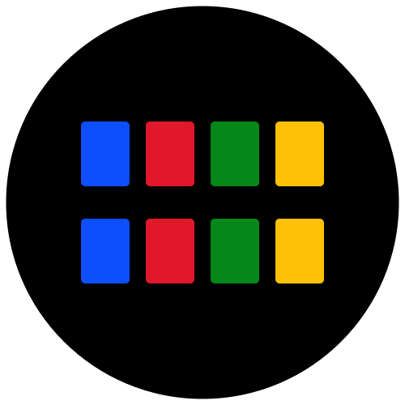

  

<h1 align="center">
  fx-new-tab
</h1>

  
  
  
  

  

  A new look for firefox homepage and the newtab page.

 

# Installation

1. Visit the [Firefox Add-ons store](https://addons.mozilla.org/en-US/firefox/addon/fx-new-tab)
2. Click "Add to Firefox"
3. Follow the prompts to complete installation

# Usage

### New Tab Page

  

After installation, simply open a new tab. Customize your settings by clicking the icon in the bottom-right corner.

### Toolbar Shortcut Action

  

To quickly add the current page as a shortcut:
1. Navigate to the page you want to add
2. Click the extension icon in the toolbar
3. The page will be instantly added as a shortcut on your new tab page

> [!TIP]
> Pin the icon to the toolbar for faster access.

## Themes

Enhance your new tab experience with our curated themes. Simply right click on the "Download" link > `Save Link As...` to get the settings file, then import it into your extension.

> [!NOTE]
> Shortcuts are for reference only.

| Theme Name | Preview | Description | Download |
|------------|---------|-------------|----------|
| Midnight Metropolis |  | Moody cityscape with square app shortcuts. | [Download](https://raw.githubusercontent.com/enfyna/fx-new-tab/main/themes/MidnightMetropolis.json) |
| Pixel Skyline |  | Retro skyline with circular app shortcuts. | [Download](https://github.com/enfyna/fx-new-tab/blob/main/themes/PixelSkyline.json) |

## Privacy

We respect your privacy. This extension does not collect or store any personal data. Shortcuts added via the toolbar action and all settings are stored locally in your browser.

## License

This project is licensed under the BSD 2-Clause License - see the [LICENSE](https://github.com/enfyna/fx-new-tab/blob/main/LICENSE) file for details.

 

<h3 align="center">
  
</h3>

 
